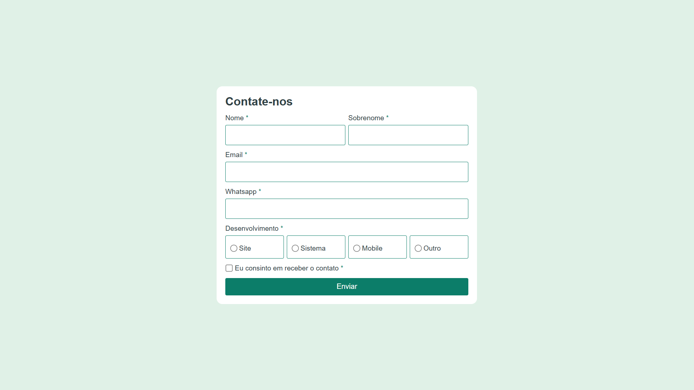

# 📬 Contact Me – Formulário de Contato Responsivo
Um formulário moderno com integração ao WhatsApp e envio de e-mail por API.

Este é um projeto de formulário de contato responsivo, desenvolvido com HTML, CSS e JavaScript. Ele permite que os usuários enviem mensagens por e-mail ou WhatsApp, com base nas informações fornecidas no formulário.

## 🔗 Acesse o projeto
[👉 Testar agora](https://contato.wallacevieira.dev/)

## ✨ Funcionalidades

- **Formulário de Contato**:
  - Campos para Nome, Sobrenome, Email, WhatsApp e Mensagem.
  - Opções de desenvolvimento: Site, Sistema, Mobile ou Outro.
  - Validação de campos obrigatórios e formatos de entrada.

- **Envio de Mensagens**:
  - Integração com a API do WhatsApp para envio de mensagens.
  - Envio de e-mails utilizando uma API externa.

- **Responsividade**:
  - Layout adaptado para diferentes tamanhos de tela (desktop, tablet e mobile).

- **Interatividade**:
  - Exibição condicional do campo de mensagem ao selecionar a opção "Outro" no campo de desenvolvimento.
  - Máscara para o campo de WhatsApp, permitindo apenas números.

## 📁 Estrutura do Projeto
- `index.html`: Estrutura do formulário
- `style.css`: Estilos e responsividade
- `script.js`: Validação, máscaras, envio de mensagens

## 📖 Como Usar

1. Clone este repositório ou baixe os arquivos.
2. Abra o arquivo `index.html` em um navegador.
3. Preencha o formulário com as informações solicitadas.
4. Clique no botão "Enviar" para:
   - Abrir o WhatsApp com uma mensagem pré-formatada.
   - Enviar um e-mail utilizando a API configurada.

## 👨‍💻 Tecnologias Utilizadas

- **HTML5**: Estrutura do formulário.
- **CSS3**: Estilização e responsividade.
- **JavaScript**: Validação, interatividade e integração com APIs.

## 🤖 APIs Utilizadas

- **WhatsApp API**: Para envio de mensagens diretamente para o WhatsApp.
- **Contact-Me API**: Para envio de e-mails. Endpoint utilizado: `https://contact-me-api-ten.vercel.app/send-email`.

## Licença

Este projeto é de uso livre e pode ser modificado conforme necessário.

---
Desenvolvido por [Wallace](https://portfolio.wallacevieira.dev)
